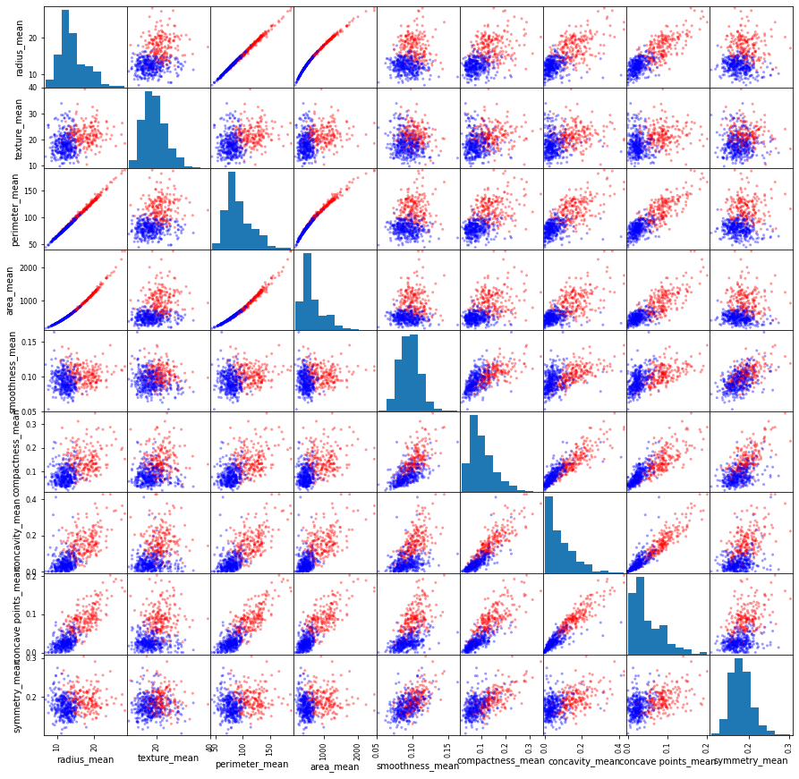
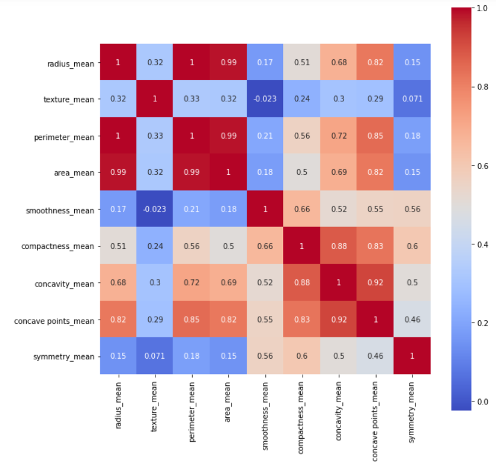

# SUAS SPARK ML PROJECT

This project implement pyspark to test machine learning algorithms on 3 seperate datasets.

# Databases
The used databases in this project are the following :
- [ ] **Breast Cancer Wisconsin** 
    - Features are computed from a digitized image of a fine needle aspirate (FNA) of a breast mass. They describe characteristics of the cell nuclei present in the image.
		n the 3-dimensional space is that described in: [K. P. Bennett and O. L. Mangasarian: "Robust Linear Programming Discrimination of Two Linearly Inseparable Sets", Optimization Methods and Software 1, 1992, 23-34]. 
- [ ] **Novel Corona Virus 2019 Dataset**: 
	- From World Health Organization - On 31 December 2019, WHO was alerted to several cases of pneumonia in Wuhan City, Hubei Province of China. The virus did not match any other known virus. This raised concern because when a virus is new, we do not know how it affects people.

	So daily level information on the affected people can give some interesting insights when it is made available to the broader data science community.

	Johns Hopkins University has made an excellent dashboard using the affected cases data. Data is extracted from the google sheets associated and made available here.
- [ ] **Political conflicts in Africa from 1997-2018**
    - The Armed Conflict Location & Event Data Project (ACLED) is a disaggregated conflict collection, analysis and crisis mapping project. ACLED collects the dates, actors, types of violence, locations, and fatalities of all reported political violence and protest events across Africa, South Asia, South East Asia, the Middle East, Europe, and Latin America. Political violence and protest includes events that occur within civil wars and periods of instability, public protest and regime breakdown. ACLED’s aim is to capture the forms, actors, dates and locations of political violence and protest as it occurs across states. The ACLED team conducts analysis to describe, explore and test conflict scenarios, and makes both data and analysis open to freely use by the public.
Please see `example/DataReader.py` an example how to prepare the data in required format for DeepFM.

## Breast Cancer Wisconsin structure

root
 |-- _c0: integer (nullable = true)
 |-- diagnosis: string (nullable = true)
 |-- radius_mean: double (nullable = true)
 |-- texture_mean: double (nullable = true)
 |-- perimeter_mean: double (nullable = true)
 |-- area_mean: double (nullable = true)
 |-- smoothness_mean: double (nullable = true)
 |-- compactness_mean: double (nullable = true)
 |-- concavity_mean: double (nullable = true)
 |-- concave points_mean: double (nullable = true)
 |-- symmetry_mean: double (nullable = true)
 |-- fractal_dimension_mean: double (nullable = true)
 |-- radius_se: double (nullable = true)
 |-- texture_se: double (nullable = true)
 |-- perimeter_se: double (nullable = true)
 |-- area_se: double (nullable = true)
 |-- smoothness_se: double (nullable = true)
 |-- compactness_se: double (nullable = true)
 |-- concavity_se: double (nullable = true)
 |-- concave points_se: double (nullable = true)
 |-- symmetry_se: double (nullable = true)
 |-- fractal_dimension_se: double (nullable = true)
 |-- radius_worst: double (nullable = true)
 |-- texture_worst: double (nullable = true)
 |-- perimeter_worst: double (nullable = true)
 |-- area_worst: double (nullable = true)
 |-- smoothness_worst: double (nullable = true)
 |-- compactness_worst: double (nullable = true)
 |-- concavity_worst: double (nullable = true)
 |-- concave points_worst: double (nullable = true)
 |-- symmetry_worst: double (nullable = true)
 |-- fractal_dimension_worst: double (nullable = true)

## Scatter Matrix 

## HeatMap 

## Principal component analysis

## Logistic regression

## Tree Classifier

## Kmeans

